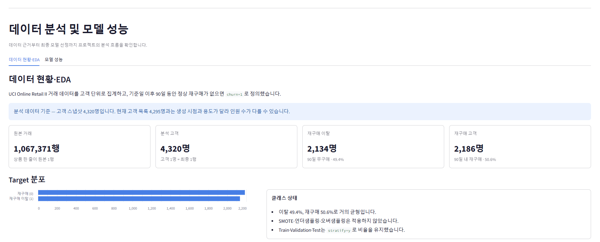
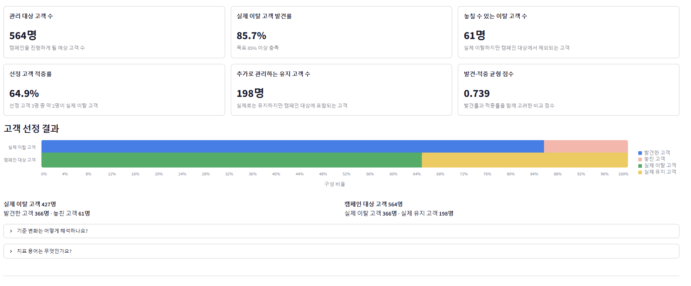
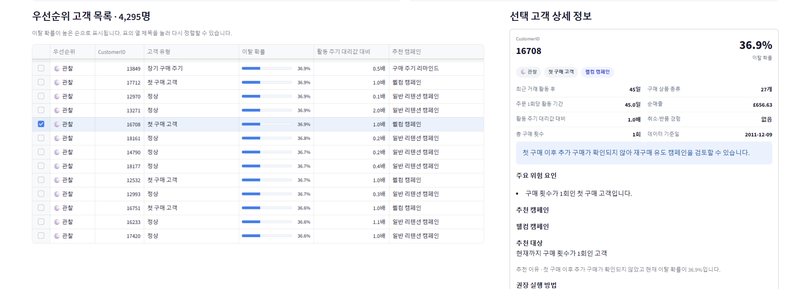
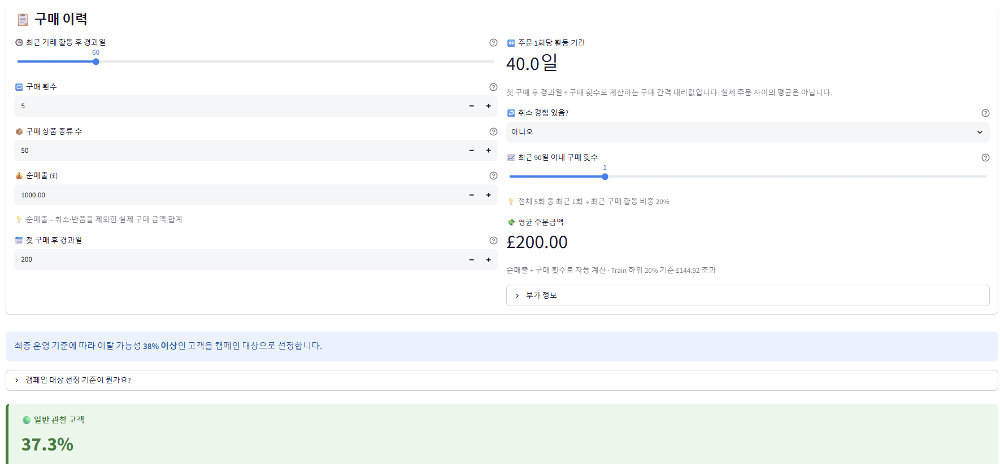
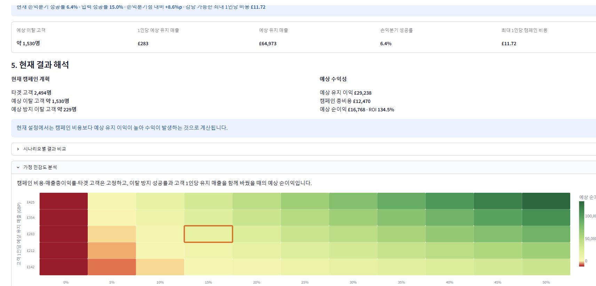

# 이탈하지 말아조 - 이커머스 구매 고객 재구매 이탈 예측

> UCI Online Retail II 거래 데이터를 고객 단위로 분석해 향후 90일 동안 재구매하지 않을 가능성이 높은 고객을 찾고, 리텐션 캠페인 의사결정을 지원하는 프로젝트입니다.

최종 결과는 저장된 XGBoost Pipeline과 Streamlit 대시보드로 연결했습니다. 대시보드에서는 모델 성능, 캠페인 대상 기준, 위험 고객군, 개별 고객 예측, ROI 시나리오를 확인할 수 있습니다.

### 대표 화면



## 목차

1. [팀 소개](#1-팀-소개)
2. [프로젝트 개요](#2-프로젝트-개요)
3. [요구사항](#3-요구사항)
4. [데이터](#4-데이터)
5. [데이터 분석 및 전처리](#5-데이터-분석-및-전처리)
6. [모델링](#6-모델링)
7. [주요 기능](#7-주요-기능)
8. [프로젝트 구조](#8-프로젝트-구조)
9. [기술 스택](#9-기술-스택)
10. [설치 및 실행](#10-설치-및-실행)
11. [수행 화면](#11-수행-화면)
12. [한계 및 개선 방향](#12-한계-및-개선-방향)
13. [회고](#13-회고)

---

## 1. 팀 소개

### 팀명

**이탈하지 말아조**

### 팀원 및 역할

<table>
  <tr>
    <td width="20%" align="center"></td>
    <td width="20%" align="center"></td>
    <td width="20%" align="center"></td>
    <td width="20%" align="center"></td>
    <td width="20%" align="center"></td>
  </tr>
  <tr>
    <td align="center"><b>👑 김문규 (kmk)</b></td>
    <td align="center"><b>이서영 (lsy)</b></td>
    <td align="center"><b>정현두 (jhd)</b></td>
    <td align="center"><b>권세진 (ksj)</b></td>
    <td align="center"><b>허유나 (hyn)</b></td>
  </tr>
  <tr>
    <td align="center"><a href="https://github.com/tender0602">github.com/<br>tender0602</a></td>
    <td align="center"><a href="https://github.com/SKN33-ai-camp-lsy04">github.com/<br>SKN33-ai-camp-lsy04</a></td>
    <td align="center"><a href="https://github.com/gusen8684">github.com/<br>gusen8684</a></td>
    <td align="center"><a href="https://github.com/tangerine0101">github.com/<br>tangerine0101</a></td>
    <td align="center"><a href="https://github.com/heoyuna0819-creator">github.com/<br>heoyuna0819-creator</a></td>
  </tr>
  <tr>
    <td align="center">팀장 · EDA<br>데이터 전처리<br>Target 정의<br>Random Forest</td>
    <td align="center">Random Forest<br>하이퍼파라미터 튜닝<br>발표</td>
    <td align="center">XGBoost<br>임계값 최적화<br>Streamlit 개발</td>
    <td align="center">Logistic Regression<br>Streamlit 개발<br>PPT</td>
    <td align="center">LightGBM<br>Feature Importance<br>SHAP · PPT</td>
  </tr>
</table>

> 역할을 완전히 분리하기보다 팀원별 후보 모델을 병렬로 개발하고, 공용 Validation 데이터와 동일한 평가 규칙으로 최종 후보를 다시 비교했습니다.

### 프로젝트 일정

| 단계 | 기간               | 주요 작업 | 산출물 |
|---|------------------|---|---|
| 기획 | 2026.07.16       | 사용자, 분석 단위, 기준일, Target 정의 | 프로젝트 요구사항 |
| 데이터 | 2026.07.16~07.18 | 품질 점검, EDA, 고객 Feature 생성 | 전처리 결과서 |
| 모델링 | 2026.07.18~07.21 | 기준 모델, 후보 모델 비교, 임계값 결정 | 학습 결과서·저장 모델 |
| 서비스 | 2026.07.20~07.22 | 저장 Pipeline 연결, Streamlit 구현 | 예측 대시보드 |
| 통합 | 2026.07.22       | 실행 검증, 문서화, 발표 준비 | README·발표자료 |

---

## 2. 프로젝트 개요

### 프로젝트 기간

- **2026.07.16 ~ 2026.07.23**

### 배경 및 필요성

온라인 소매업에서는 이미 이탈한 고객을 확인하는 것보다 이탈 가능성이 높은 고객을 사전에 찾아 적절한 유지 활동을 제공하는 것이 중요합니다. 그러나 원본 거래 로그에는 회원 탈퇴 여부가 없으므로, 구매 행동을 고객 단위로 집계하고 일정 기간의 미구매 상태를 재구매 이탈의 대리 Target으로 정의했습니다.

### 프로젝트 목표

1. 거래 상품 행을 고객 단위 행동 Feature로 변환하고 미래 정보 유입을 차단합니다.
2. 여러 분류 모델을 동일한 조건에서 비교해 이탈 고객 탐지에 적합한 운영안을 선택합니다.
3. 저장된 모델을 Streamlit과 연결해 고객 관리 기준 및 ROI 시나리오를 제공합니다.

### 문제 정의

> 고객 유지 업무 담당자가 리텐션 캠페인 대상을 결정할 수 있도록, 기준일 이전 거래 행동을 이용해 향후 90일 재구매 이탈 여부를 예측하고 위험도에 맞는 관리 전략을 제안합니다.

| 항목 | 정의 |
|---|---|
| 사용자 | 고객 관리 및 리텐션 캠페인 담당자 |
| 분석 단위 | 기준일 이전 365일 안에 구매한 식별 가능 고객 1명 |
| 기준일 | 2011-09-10 |
| 입력 정보 | 기준일 이전 거래로 만든 고객 행동 Feature 10개 |
| Target | 향후 90일 동안 정상 재구매가 없으면 `churn=1`, 있으면 `churn=0` |
| 주요 평가지표 | Recall 우선, Precision·F1·ROC-AUC·PR-AUC 함께 확인 |
| 중요 오류 | 실제 이탈 고객을 놓치는 FN |
| 활용 방법 | 고위험 고객 선정, 위험군별 캠페인, 개별 예측, ROI 비교 |

### 90일 Target 선정 근거

재구매 간격 분포에서 약 75% 지점은 62일, 90% 지점은 135일이었습니다. 이를 근거로 60일·90일·120일 Target 민감도 분석을 수행했습니다. 기간이 길어질수록 이탈률은 감소했지만 모델의 전반적인 순위 판별력은 크게 흔들리지 않았습니다. 따라서 90일을 조기 개입 가능성과 충분한 재구매 관찰 기간 사이의 운영상 절충값으로 사용했습니다.

---

## 3. 요구사항

### 분석 요구사항

| ID | 요구사항 | 완료 |
|---|---|---|
| AR-01 | 거래 행을 고객 단위 Feature로 집계 | ✅ |
| AR-02 | 기준일 이후 정보가 Feature에 포함되지 않도록 누수 차단 | ✅ |
| AR-03 | 60·90·120일 Target 민감도 분석 | ✅ |
| AR-04 | Dummy·Logistic을 포함한 복수 모델 비교 | ✅ |
| AR-05 | Validation에서 모델·하이퍼파라미터·Threshold 선택 | ✅ |
| AR-06 | Recall 0.85 이상인 운영점 중 F1 최대 기준 적용 | ✅ |
| AR-07 | Test를 최종 확정 후 한 번만 평가 | ✅ |

### 서비스 요구사항

| ID | 기능 | 설명 | 완료 |
|---|---|---|---|
| FR-01 | 모델 성능 분석 | 데이터 개요, 성능, 혼동행렬과 주요 Feature 확인 | ✅ |
| FR-02 | 캠페인 기준 설정 | 권장 Threshold와 기준 변화에 따른 예상 결과 비교 | ✅ |
| FR-03 | 위험 고객 세분화 | 행동 특성에 따라 위험 고객군과 대응 전략 제공 | ✅ |
| FR-04 | 개별 고객 예측 | 고객 행동값을 입력해 이탈 점수와 분류 결과 출력 | ✅ |
| FR-05 | ROI 시뮬레이션 | 비용·성공률·고객가치 가정에 따른 손익 비교 | ✅ |
| FR-06 | 대상 고객 다운로드 | 캠페인 대상 결과를 Excel로 저장 | ✅ |
| FR-07 | 실고객 ID 기반 원거래 추적 | 익명 ID 보존 후 개별 오류 사례 연결 | 향후 개선 |

---

## 4. 데이터

### 데이터 출처

| 항목 | 내용 |
|---|---|
| 데이터셋 | UCI Online Retail II |
| 제공 기관 | UCI Machine Learning Repository |
| 출처 | <https://archive.ics.uci.edu/dataset/502/online+retail+ii> |
| 라이선스 | CC BY 4.0 |
| 수집 방법 | KaggleHub 또는 원본 CSV 다운로드 |
| 데이터 기간 | 2009-12-01 07:45 ~ 2011-12-09 12:50 |
| 원본 규모 | 1,067,371행 × 8열 |
| 금액 단위 | GBP (£) |

원본 데이터의 한 행은 고객 한 명이 아니라 주문에 포함된 상품 한 줄입니다. 고객 이탈을 예측하기 위해 `CustomerID` 기준의 고객 스냅샷으로 변환했습니다.

### Target 분포

| Target | 의미 | 고객 수 | 비율 |
|---|---|---:|---:|
| 0 | 향후 90일 안에 정상 재구매 | 2,186 | 50.6% |
| 1 | 향후 90일 동안 정상 재구매 없음 | 2,134 | 49.4% |

클래스 비율을 인위적으로 50:50에 맞춘 것은 아닙니다. 재구매 간격과 캠페인 개입 가능성을 기준으로 90일을 선택한 결과이며, 균형적인 분포 덕분에 별도의 재표본화가 필요하지 않았습니다.

### 원본 컬럼

| 컬럼 | 설명 | 활용 |
|---|---|---|
| `Invoice` | 주문·송장 번호 | 구매 횟수 및 취소 판별 |
| `StockCode` | 상품 코드 | 고유 상품 수와 정상 상품 판별 |
| `Description` | 상품 설명 | 모델 입력 제외 |
| `Quantity` | 수량 | 정상 판매·반품 판별 |
| `InvoiceDate` | 주문 일시 | 관찰·결과 기간 분리 |
| `Price` | 상품 단가 | 정상 판매 및 매출 계산 |
| `CustomerID` | 익명 고객 식별자 | 고객 집계에만 사용, 모델 입력 제외 |
| `Country` | 국가 | `is_uk` 생성 |

---

## 5. 데이터 분석 및 전처리

### 데이터 품질 점검

| 점검 항목 | 확인 결과 | 처리 방법과 근거 |
|---|---|---|
| CustomerID 결측 | 243,007행, 22.8% | 고객 단위 재구매 추적이 불가능해 제외 |
| Description 결측 | 4,382행 | 최종 Feature가 아니므로 대치하지 않음 |
| 완전 중복 행 | 34,335행 | 복수 수량 기록 가능성이 있어 삭제하지 않고 집계 |
| 취소 Invoice | 19,494행 | 정상 구매에서는 제외, 반품 행동에는 활용 |
| `Quantity <= 0` | 22,950행 | 정상 구매에서 제외, 취소·반품 정보로 활용 |
| `Price <= 0` | 6,207행 | 정상 유상 구매가 아니므로 제외 |
| 비상품 StockCode | 6,094행 | 우편료·수수료 등으로 판단해 정상 상품에서 제외 |
| 클래스 불균형 | 49.4% 대 50.6% | SMOTE·언더샘플링·오버샘플링 미적용 |
| 데이터 누수 | 미래 거래가 존재 | 기준일 이후 거래는 Target 판정에만 사용 |

정상 구매 조건을 적용한 결과 802,632개의 거래 행과 5,852명의 식별 가능 고객이 남았습니다. 기준일 이전 365일 안에 구매한 활성 고객 4,320명을 최종 분석 대상으로 사용했습니다.

### 핵심 EDA

#### Target별 주요 Feature


이탈 고객은 재구매 고객보다 최근 거래 활동 후 경과일과 평균 거래 간격이 길고, 구매 횟수·상품 다양성·순매출·최근 활동 비중은 낮았습니다. 이는 최근성 하나가 아니라 구매 빈도와 활동 패턴을 함께 사용하는 근거가 되었습니다.

#### Feature 분포


구매 횟수, 상품 다양성, 순매출은 일부 우량 고객으로 인해 오른쪽 꼬리가 길었습니다. 실제 고객 행동일 수 있어 단순 IQR 제거를 적용하지 않았고, 순매출에는 `log1p` 변환을 사용했습니다.

#### 상관관계


Target과의 절대 상관은 평균 거래 간격, 최근 거래 활동 후 경과일, 상품 다양성, 구매 횟수 순으로 상대적으로 컸습니다. 상관계수는 선형 관계만 나타내므로 단독 Feature 제거 기준으로 사용하지 않았습니다.

### 데이터 분할

| 데이터 | 고객 수 | 비율 | 사용 목적 |
|---|---:|---:|---|
| Train | 2,592 | 60% | 전처리기와 모델 학습 |
| Validation | 864 | 20% | 후보·하이퍼파라미터·Threshold 선택 |
| Test | 864 | 20% | 최종 확정 후 1회 평가 |

- 분할 방법: Target 비율을 보존한 층화 무작위 분할
- Random State: `42`
- 전처리기와 `is_low_value` 기준은 Train에만 `fit`

### 최종 Feature

| Feature | 의미 | 처리 |
|---|---|---|
| `net_revenue` | 반품을 차감한 순매출 | 음수를 0으로 치환 → `log1p` → 표준화 |
| `recency_days` | 최근 거래 활동 후 경과일 | 표준화 |
| `frequency` | 고유 구매 Invoice 수 | 표준화 |
| `distinct_products` | 구매한 고유 상품 수 | 표준화 |
| `tenure_days` | 첫 구매 후 고객 활동 기간 | 표준화 |
| `avg_days_between_orders` | 주문 1회당 활동 기간 | 표준화 |
| `is_low_value` | 평균 주문금액 Train 하위 20% 여부 | 0/1 |
| `is_uk` | 주요 국가가 UK인지 여부 | 0/1 |
| `has_return` | 반품 경험 여부 | 0/1 |
| `recent_activity_ratio` | 전체 주문 중 최근 90일 주문 비중 | 0~1 |

---

## 6. 모델링

### 실험 원칙

- DummyClassifier와 기본 Logistic Regression을 기준선으로 사용했습니다.
- 팀원별 저장 후보를 공용 Validation 864명에서 동일한 평가 함수로 다시 비교했습니다.
- 후보마다 확률 분포가 다르므로 기본 0.5뿐 아니라 공통 Threshold 선택 규칙을 적용했습니다.
- Test는 모델과 Threshold를 모두 고정한 뒤 한 번만 평가했습니다.

### 후보 모델

| 모델 | 선정 이유 |
|---|---|
| DummyClassifier | Feature를 사용하지 않는 무작위 수준의 기준 확인 |
| Logistic Regression | 해석 가능한 선형 기준선 |
| Random Forest | 비선형성과 변수 간 상호작용 학습 |
| XGBoost | 규제와 부스팅을 활용한 표형 데이터 분류 |
| LightGBM | 효율적인 부스팅과 XGBoost 대안 비교 |

### Validation 성능 비교

각 모델에서 `Recall >= 0.85`인 Threshold 중 F1이 가장 높은 운영점을 비교했습니다.

| 모델 | Threshold | Recall | Precision | F1 | ROC-AUC | PR-AUC |
|---|---:|---:|---:|---:|---:|---:|
| LightGBM | 0.45 | 0.860 | 0.644 | 0.736 | **0.775** | **0.747** |
| **XGBoost** | **0.38** | **0.857** | **0.649** | **0.739** | 0.767 | 0.735 |
| Random Forest (kmk) | 0.35 | 0.892 | 0.626 | 0.736 | 0.767 | 0.739 |
| Random Forest (lsy) | 0.33 | 0.890 | 0.627 | 0.736 | 0.757 | 0.727 |
| Logistic Regression (튜닝) | 0.37 | 0.850 | 0.629 | 0.723 | 0.757 | 0.730 |
| Logistic Regression (기본) | 0.35 | 0.871 | 0.618 | 0.723 | 0.760 | 0.731 |


### 임계값 결정

1. Validation에서 Threshold 0.20~0.70을 0.01 간격으로 탐색했습니다.
2. `Recall >= 0.85`인 후보만 남겼습니다.
3. 남은 후보 중 F1이 가장 높은 지점을 선택했습니다.
4. 동률이면 더 높은 Threshold를 선택해 불필요한 FP를 줄였습니다.
5. 선택한 0.38을 고정하고 Test에서는 재조정하지 않았습니다.


`0.38`은 전체 고객의 38%를 선정한다는 의미가 아니라 모델의 이탈 점수가 0.38 이상인 고객을 캠페인 대상으로 분류한다는 의미입니다.

### 최종 모델 및 Test 결과

| 항목 | 내용 |
|---|---|
| 최종 모델 | XGBoost |
| 선정 데이터 | Validation |
| 선정 기준 | Recall 0.85 이상인 후보 중 F1 최대 |
| 운영 Threshold | 0.38 |
| 입력 Feature | 10개 |
| 모델 파일 | `models/final/model_final.joblib` |
| 통합 Pipeline | `models/final/churn_pipeline.joblib` |

| 모델/기준 | Accuracy | Precision | Recall | F1 | ROC-AUC | PR-AUC |
|---|---:|---:|---:|---:|---:|---:|
| Logistic, 0.50 | 0.683 | 0.675 | 0.691 | 0.683 | **0.754** | **0.726** |
| **XGBoost, 0.38** | 0.679 | 0.628 | **0.860** | **0.726** | 0.753 | 0.704 |

최종 운영안은 기본 Logistic보다 이탈 고객을 72명 더 탐지해 FN을 132명에서 60명으로 줄였습니다. 대신 FP는 142명에서 217명으로 증가했습니다. 따라서 XGBoost가 모든 지표에서 압도적이라기보다 저비용 리텐션 캠페인과 Recall 중심 목적에 더 적합한 운영안으로 해석했습니다.


---

## 7. 주요 기능

### 1. 모델 성능 분석

- 프로젝트 데이터와 Target 정의 확인
- 최종 모델의 성능·혼동행렬·ROC/PR Curve 확인
- 주요 Feature 및 오류 고객군 해석

### 2. 캠페인 대상 기준 설정

- 권장 운영 Threshold 0.38 제공
- Threshold 변화에 따른 TP·FP·FN·TN 및 대상 규모 비교
- 이탈 탐지율과 캠페인 비용 사이의 균형 확인

### 3. 위험 고객 세분화

- 최근 활동, 구매 빈도와 거래 간격에 따른 위험군 구분
- 단기 이탈 방지, 구매주기 리마인드 등 관리 전략 제안

### 4. 개별 고객 예측

- 고객 행동 Feature 입력
- 저장된 `churn_pipeline.joblib`을 이용한 이탈 점수 계산
- 운영 Threshold에 따른 이탈 분류 및 결과 설명

### 5. ROI 시뮬레이션

- 캠페인 비용, 성공률, 유지 매출 가정 입력
- 시나리오별 예상 수익·비용·순이익·ROI 비교
- 실제 인과효과가 아니라 운영 가정 비교용 추정치임을 명시

> Streamlit에서는 모델을 다시 학습하지 않고 저장된 전처리 Pipeline과 최종 모델을 불러와 사용합니다.

---

## 8. 프로젝트 구조

```text
Project2/
├── README.md
├── requirements.txt
├── assets/
│   └── streamlit/                  # README용 Streamlit 화면 캡처
├── data/
│   ├── raw/
│   └── preprocessed/
├── notebooks/
│   ├── check.ipynb
│   ├── eda_log.ipynb
│   ├── eda_customer.ipynb
│   ├── preprocessing.ipynb
│   └── model_experiments.ipynb
├── src/
│   ├── data.py
│   ├── features.py
│   ├── transforms.py
│   └── prepare_data.py
├── models/
│   ├── final/
│   │   ├── model_final.joblib
│   │   ├── churn_pipeline.joblib
│   │   └── preprocessor_prototype.joblib
│   ├── kmk/                        # Random Forest 후보
│   ├── lsy/                        # Random Forest 후보
│   ├── jhd/                        # XGBoost 후보
│   ├── ksj/                        # Logistic Regression 후보
│   └── hyn/                        # LightGBM 후보
├── artifacts/
│   ├── feature_schema.json
│   ├── model_metadata.json
│   ├── metrics.csv
│   ├── error_analysis.csv
│   ├── calibration_metrics.csv
│   └── permutation_importance.csv
├── reports/
│   ├── preprocessing_report.md
│   ├── training_report.md
│   └── figures/
├── streamlit_app/
│   ├── app.py
│   ├── config.py
│   ├── customer_scoring.py
│   ├── model_loader.py
│   └── tabs/
└── tests/
```

### 폴더별 상세 설명

| 경로 | 역할 | 주요 내용 |
|---|---|---|
| `assets/streamlit/` | README 화면 자료 | Streamlit 주요 기능을 보여주는 캡처 이미지 5개 |
| `data/raw/` | 원본 데이터 | UCI Online Retail II 원본 거래 데이터 |
| `data/preprocessed/` | 학습용 데이터 | 고객 단위로 변환한 Train·Validation·Test Feature와 Target, 저장 전처리기 |
| `notebooks/` | 분석 및 실험 기록 | 데이터 점검, 거래·고객 EDA, 전처리 검증, 후보 모델 비교 과정 |
| `src/` | 데이터 처리 코드 | 원본 로드, 정상 거래 필터링, 고객 Feature·Target 생성, 데이터 분할과 전처리 |
| `models/final/` | 최종 모델 산출물 | XGBoost 모델, 전처리기, 전처리와 모델을 결합한 추론 Pipeline |
| `models/kmk/`, `models/lsy/` | Random Forest 실험 | 팀원별 Random Forest 모델과 실험 Notebook |
| `models/jhd/` | XGBoost 실험 | XGBoost 후보 학습, 임계값 최적화와 모델 비교 |
| `models/ksj/` | Logistic Regression 실험 | 선형 기준 모델 학습과 하이퍼파라미터 비교 |
| `models/hyn/` | LightGBM 실험 | LightGBM 학습, Feature Importance와 SHAP 분석 |
| `artifacts/` | 평가·재현 메타데이터 | 성능표, 오류 분석, Calibration, Feature 정의와 모델 메타데이터 |
| `reports/` | 결과 보고서 | 데이터 전처리 결과서, 인공지능 학습 결과서와 보고서용 그래프 |
| `streamlit_app/` | 예측 서비스 | 모델 성능, 캠페인 기준, 위험 고객, 개별 예측과 ROI 화면 |
| `tests/` | 추론 검증 | 저장 Pipeline 로드, 입력 Feature와 단일 고객 예측 테스트 |

### 주요 실행 파일

| 파일 | 설명 |
|---|---|
| `src/data.py` | 원본 거래 데이터 로드 및 정상 구매 조건 적용 |
| `src/features.py` | 고객 단위 Feature 집계와 90일 재구매 이탈 Target 생성 |
| `src/transforms.py` | 로그 변환, 스케일링 등 공통 전처리 함수 |
| `src/prepare_data.py` | Train·Validation·Test 분할, 전처리 학습과 결과 저장 |
| `notebooks/model_experiments.ipynb` | 저장 후보 모델의 공통 Validation 비교와 최종 평가 재현 |
| `streamlit_app/app.py` | Streamlit 서비스 진입점과 화면 구성 |
| `streamlit_app/model_loader.py` | 최종 Pipeline과 모델 산출물 로드 |
| `streamlit_app/customer_scoring.py` | 고객 이탈 점수 계산과 위험 고객 데이터 구성 |
| `tests/test_inference.py` | 저장 Pipeline을 이용한 신규 고객 추론 검증 |

---

## 9. 기술 스택

| 구분 | 기술 | 사용 목적 |
|---|---|---|
| Language | Python 3.12 | 데이터 분석, 모델링, 서비스 |
| Data | Pandas, NumPy | 데이터 로드·정제·고객 집계 |
| Visualization | Matplotlib, Seaborn, Altair | EDA 및 대시보드 시각화 |
| Machine Learning | scikit-learn, XGBoost, LightGBM | 모델 학습·평가 |
| Explainability | SHAP, Permutation Importance | Feature 영향 분석 |
| Tuning | Optuna | 하이퍼파라미터 탐색 |
| Service | Streamlit | 예측 및 캠페인 대시보드 |
| Artifact | Joblib, OpenPyXL | Pipeline 저장, 결과 Excel 다운로드 |
| Collaboration | Git, GitHub | 버전 관리와 협업 |

---

## 10. 설치 및 실행

### 권장 환경

- Python 3.12
- Windows PowerShell 기준 예시

### 저장소 복제 및 설치

```powershell
git clone https://github.com/SKNETWORKS-FAMILY-AICAMP/SKN33-2nd-5Team.git Project2
cd Project2

python -m venv .venv
.\.venv\Scripts\Activate.ps1
python -m pip install -r requirements.txt
```

### 데이터 준비

```powershell
python -m src.data
python -m src.prepare_data
```

### 저장 Pipeline 검증

```powershell
python -m pytest tests/test_inference.py
```

### Streamlit 실행

```powershell
streamlit run streamlit_app/app.py
```

실행 후 브라우저에서 표시되는 로컬 주소로 접속합니다. 원본 데이터 경로와 저장 모델 경로는 프로젝트 폴더 구조를 유지해야 합니다.

---

## 11. 수행 화면

### 1. 데이터 분석 및 모델 성능


원본 거래 1,067,371행을 고객 4,320명의 스냅샷으로 변환한 과정과 Target 분포를 확인합니다. 모델 성능 탭에서는 후보 모델 비교, 최종 Test 결과, 혼동행렬과 Feature 해석을 제공합니다.

### 2. 캠페인 대상 선정



권장 Threshold 0.38을 기준으로 관리 대상 고객 수, 실제 이탈 고객 발견율, 놓칠 수 있는 이탈 고객 수, Precision과 F1을 고객 수와 비율로 보여줍니다. 기준 변화에 따라 캠페인 대상과 오류 구성이 어떻게 달라지는지도 비교할 수 있습니다.

### 3. 우선순위 고객 조회



고객별 이탈 점수와 행동 특성을 바탕으로 우선순위 고객 목록을 제공합니다. 선택한 고객의 구매 이력, 고객 유형, 주요 위험 요인과 추천 캠페인을 함께 확인할 수 있습니다.

### 4. 개별 고객 이탈 예측



최근 거래 활동 후 경과일, 구매 횟수, 상품 종류, 순매출과 최근 활동 비중 등을 입력하면 저장된 Pipeline이 이탈 점수를 계산합니다. 운영 기준 0.38과 비교해 고객 상태와 관리 필요성을 안내합니다.

### 5. ROI 시뮬레이션



캠페인 비용, 이탈 방지 성공률과 고객 1인당 유지 매출을 바꿔 예상 유지 이익, 총비용, 순이익과 ROI를 비교합니다. 가정 민감도 분석을 통해 어떤 조건에서 캠페인이 경제성을 확보하는지 확인할 수 있습니다.

---

## 12. 한계 및 개선 방향

| 현재 한계 | 결과에 미치는 영향 | 향후 개선 방법 |
|---|---|---|
| 실제 탈퇴가 아닌 90일 미구매 Target | 장기 구매주기 고객을 이탈로 판단할 수 있음 | 실제 탈퇴·캠페인 반응 데이터 확보, 고객군별 주기 적용 |
| 단일 기준일과 무작위 층화 분할 | 실제 미래 시점의 일반화 성능을 충분히 검증하지 못함 | 여러 기준일의 시간 순서 기반 검증 |
| 후보별 튜닝 예산 차이 | 엄밀하게 통제된 알고리즘 벤치마크가 아님 | 동일 탐색 공간·예산으로 재실험 |
| 실제 FP·FN 비용 부재 | Recall 0.85가 운영 가정에 기반함 | 고객가치와 캠페인 비용을 이용한 기대이익 최적화 |
| 별도 확률 보정 미적용 | 0.38을 정확한 실제 이탈 확률로 해석할 수 없음 | Calibration 재학습과 운영 데이터 검증 |
| 고객 ID 미보존 | 개별 오류 고객을 원거래까지 추적하기 어려움 | 모델 입력과 분리된 익명 키 파일 보존 |
| 모델 성능과 캠페인 효과의 차이 | 예측이 실제 이탈 방지로 이어졌는지 확인할 수 없음 | 무작위 대조군을 둔 A/B 테스트 |

관찰된 상관관계를 인과관계로 단정하지 않으며, 예측 결과는 고객 관리 의사결정을 보조하는 자료로 사용해야 합니다.

---

## 13. 회고

### 팀 회고

#### 잘한 점

- 거래 상품 행을 고객 스냅샷으로 전환하고 재구매 이탈 Target을 직접 정의했습니다.
- 팀원별 후보를 공용 Validation과 동일한 운영 규칙으로 다시 비교했습니다.
- 모델 학습에 그치지 않고 저장 Pipeline, 캠페인 기준, 위험군, ROI 화면으로 연결했습니다.
- 전처리·학습 결과서, 메타데이터, 테스트 코드로 재현 근거를 남겼습니다.

#### 어려웠던 점

- 실제 탈퇴 라벨이 없어 미구매 기간을 대리 Target으로 정의해야 했습니다.
- Recall을 높일수록 FP와 캠페인 비용이 늘어나는 운영상 절충이 필요했습니다.
- 후보 모델의 튜닝 방식과 실험 예산을 완전히 동일하게 통제하기 어려웠습니다.

#### 배운 점

- 높은 Accuracy보다 사용자 목적에 맞는 오류 비용과 평가 기준이 중요했습니다.
- 모델과 Threshold는 분리된 의사결정이며 Validation에서 함께 관리해야 했습니다.
- 저장된 전처리기와 모델을 하나의 Pipeline으로 제공해야 신규 입력을 안정적으로 처리할 수 있었습니다.


### 개인 회고

#### 김문규

이번 프로젝트에서는 거래 단위 데이터를 고객 단위로 변환하고, 프로젝트 목적에 맞는 이탈 기준과 Feature를 정의하는 과정을 경험했습니다. 여러 모델을 비교하면서 Accuracy뿐만 아니라 실제 이탈 고객을 놓치지 않는 Recall과 비즈니스 목적에 맞는 평가 기준이 중요하다는 점을 배웠습니다.

모델 학습에 그치지 않고 캠페인 대상 선정과 ROI 분석까지 연결하여 실제 활용 가능성을 고민한 점이 의미 있었습니다. 프로젝트를 진행하며 제가 놓치거나 잘못 이해한 부분도 있었지만, 팀원들이 함께 검토하고 보완점을 찾아준 덕분에 문제를 빠르게 해결하고 프로젝트를 원활하게 진행할 수 있었습니다. 이를 통해 개인의 작업 역량뿐 아니라 서로의 결과를 확인하고 의견을 나누는 협업 과정도 중요하다는 것을 느꼈습니다.

다양한 분석 결과와 기능을 한정된 시간 안에 핵심만 선별하여 전달하는 과정은 쉽지 않았습니다. 앞으로는 기술적인 내용을 비전공자도 이해하기 쉽게 설명하고, 분석 결과를 더욱 간결하고 명확하게 전달하는 역량을 키우고 싶습니다.

#### 정현두

이번 프로젝트에서 XGBoost 모델링과 임계값 최적화, Streamlit 대시보드 개발을 담당했습니다. 모델의 기본 임계값을 그대로 사용하지 않고, 이탈 고객을 놓치지 않도록 Recall 85% 이상을 조건으로 설정한 뒤 F1이 가장 높은 0.38을 최종 기준으로 선정했습니다.

모델 성능뿐만 아니라 전처리와 Feature 순서가 실제 서비스에서도 동일하게 적용되는지 확인하는 과정이 중요하다는 것을 배웠습니다. 또한 캐시 갱신, 변수 명칭, ROI 해석 등 사용자가 결과를 오해할 수 있는 부분을 개선하면서 모델을 이해하기 쉽게 전달하는 것도 개발의 중요한 부분임을 느꼈습니다.

팀원들과 다양한 모델을 동일한 기준으로 비교하고 함께 최종 모델을 선정한 경험이 의미 있었습니다. 향후에는 취소 거래 집계를 보완하고 시간 순서 검증과 확률 보정을 추가해 모델의 실무 활용 가능성을 높이고 싶습니다.

#### 허유나

이커머스 고객 이탈 예측이라는 하나의 문제를 각자 다른 모델로 풀어보면서, 정답이 하나가 아니라 “어떤 기준으로 좋은 모델인가”부터 팀이 함께 정의해가는 과정 자체가 값진 경험이었습니다.

개인적으로는 LightGBM 모델링 중 예측 확률이 이상하게 좁게 뭉치는 현상을 발견하고, patience 문제라는 첫 가설을 직접 검증해서 기각한 뒤 진짜 원인을 찾아낸 것이 가장 기억에 남습니다. 눈에 보이는 지표 하나만 보고 넘어가지 않고 그 뒤에 숨은 원인까지 끝까지 확인해야 한다는 것을 직접 배운 시간이었습니다.

앞으로도 결과가 그럴듯해 보일 때일수록 한 번 더 의심하고 검증하는 습관을 이어가고 싶습니다.

#### 권세진

각자 모델링을 직접 수행해보는 과정이 좋은 경험이 되었습니다. 또한 팀원들이 만든 다양한 모델을 살펴보며 모델별 특징과 관련 개념을 다시 공부할 수 있었습니다.

여러 모델의 성능을 비교하고 최적의 모델을 선정하는 과정은 생각보다 어려웠습니다. 고객 이탈을 더 많이 방지하려면 관리 대상과 비용이 증가하기 때문에, 성능과 비용 사이의 적절한 절충안을 찾기 위해 다양한 상황을 고려해야 했습니다.

어려움이 있었지만 팀장님께서 방향을 많이 제시해주신 덕분에 프로젝트를 잘 마무리할 수 있었습니다. 함께해주신 팀원들과 팀장님께 감사드립니다.

#### 이서영

고객 이탈을 주제로 2차 프로젝트를 진행했습니다. 아이디어를 선정하는 과정부터 모델을 구현하고 발표하기까지 고민도 많았지만, 팀원들과 협력하는 과정이 뜻깊었습니다.

팀원들과 원활하게 소통한 덕분에 프로젝트를 진행하면서 모델을 완성하는 전반적인 과정을 경험할 수 있었습니다. 이론적으로만 알고 있던 내용들이 이번 프로젝트를 통해 하나로 연결되었습니다.

특히 제가 구현한 Random Forest 모델과 다른 팀원들의 모델을 비교하면서 다양한 모델이 존재하는 이유와 각 모델을 비교하는 과정의 필요성을 직접 배울 수 있었습니다.

---

## 참고 산출물

- [`reports/preprocessing_report.md`](reports/preprocessing_report.md): 데이터 전처리 결과서
- [`reports/training_report.md`](reports/training_report.md): 모델 학습 결과서
- [`models/final/churn_pipeline.joblib`](models/final/churn_pipeline.joblib): 전처리와 모델을 결합한 최종 Pipeline
- [`artifacts/feature_schema.json`](artifacts/feature_schema.json): 입력 Feature 및 Target 정의
- [`artifacts/model_metadata.json`](artifacts/model_metadata.json): 최종 모델·Threshold 메타데이터
- [`artifacts/metrics.csv`](artifacts/metrics.csv): Validation 후보와 Test 성능
- [`tests/test_inference.py`](tests/test_inference.py): 저장 Pipeline 추론 검증
