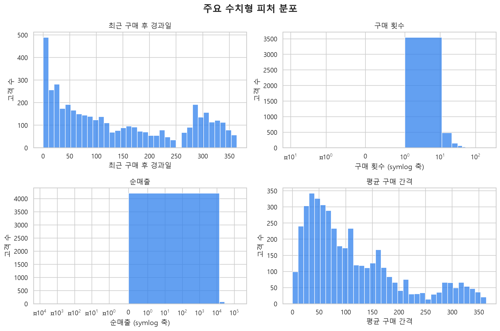
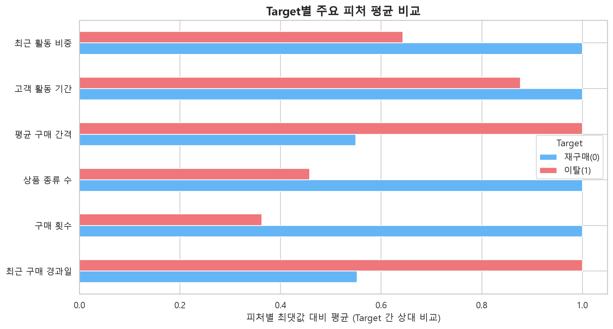
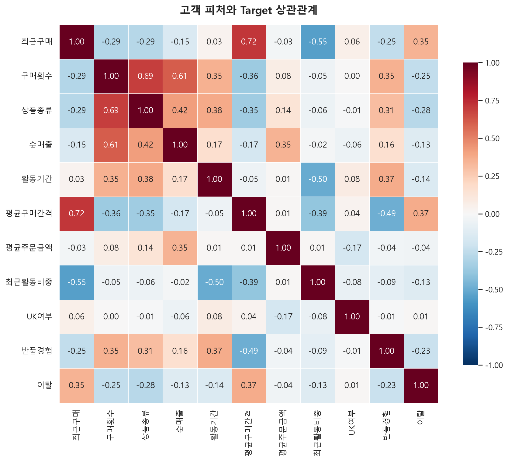

# 이커머스 구매 고객 재구매 이탈 예측 — 데이터 전처리 결과서

이 문서는 UCI Online Retail II 거래 데이터를 최종 학습 데이터로 변환한 과정과 판단 근거를 기록한다. 이 프로젝트에서 말하는 이탈은 회원 탈퇴가 아니라, 기준일 이후 90일 동안 정상 구매가 관측되지 않은 상태를 뜻한다.

## 1. 데이터 소개

| 항목 | 내용 |
|---|---|
| 데이터명 | Online Retail II |
| 제공 기관 | UCI Machine Learning Repository |
| 출처 | 영국 온라인 소매업체의 실제 거래 기록 |
| 라이선스 | CC BY 4.0 |
| 실제·합성 여부 | 실제 데이터 |
| 원본 파일 | `data/raw/online_retail_II.csv` |
| 데이터 기간 | 2009-12-01 07:45 ~ 2011-12-09 12:50 |
| 원본 크기 | 1,067,371행 × 8열 |
| 금액 단위 | GBP (£) |

데이터 출처: <https://archive.ics.uci.edu/dataset/502/online+retail+ii>

원본의 한 행은 고객 한 명이 아니라 주문에 포함된 상품 한 줄이다. 따라서 고객 이탈을 예측하려면 거래 행을 `CustomerID` 기준 고객 단위로 집계해야 한다.

| 원본 변수 | 의미 | 원본 자료형 | 활용 |
|---|---|---|---|
| `Invoice` | 주문·송장 번호 | 문자열 | 구매 횟수 및 취소 주문 판별 |
| `StockCode` | 상품 코드 | 문자열 | 고유 상품 수 및 정상 상품 판별 |
| `Description` | 상품 설명 | 문자열 | 모델 입력에서는 제외 |
| `Quantity` | 수량 | 정수 | 정상 판매·반품 판별, 매출 계산 |
| `InvoiceDate` | 주문 일시 | 날짜·시간 | 관찰/결과 기간 분리 및 시간 변수 생성 |
| `Price` | 상품 단가 | 실수 | 정상 판매 판별 및 매출 계산 |
| `CustomerID` | 익명 고객 식별자 | 원본 실수, 정제 후 정수형 식별자 | 고객 단위 집계 |
| `Country` | 주문 국가 | 문자열 | `is_uk` 생성 |

## 2. 분석 기준

| 항목 | 정의 |
|---|---|
| 서비스 사용자 | 고객 관리 및 유지 캠페인 담당자 |
| 분석 단위 | `CustomerID`가 확인되는 구매 고객 1명 = 1행 |
| 기준일 | 2011-09-10 |
| 과거 관찰 조건 | 기준일 이전 365일 안에 구매 이력이 있는 고객 |
| Feature 관찰 구간 | 기준일 이전 거래만 사용 |
| Target 관찰 구간 | 기준일 다음 날부터 90일 |
| `churn=1` | 결과 관찰 구간에 정상 재구매가 없음 |
| `churn=0` | 결과 관찰 구간에 정상 재구매가 있음 |

Target은 원본에 존재하지 않으며 `src/features.py`의 `make_snapshot()`에서 생성한다. 기준일 이후 거래는 Target 판정에만 사용하고 Feature에는 포함하지 않는다. 따라서 예측 시점에 알 수 없는 미래 정보가 모델 입력으로 들어가지 않는다.

## 3. 품질 점검

### 3.1 결측치

| 변수 | 결측 행 | 비율 | 처리 근거 |
|---|---:|---:|---|
| `CustomerID` | 243,007 | 22.8% | 동일 고객의 재구매 여부를 추적할 수 없어 고객 단위 분석에서 제외 |
| `Description` | 4,382 | 0.4% | 최종 모델 Feature가 아니므로 별도 대치하지 않음 |
| 나머지 변수 | 0 | 0.0% | 추가 처리 없음 |

`CustomerID` 결측값을 임의 값으로 대치하면 서로 다른 고객이 합쳐지거나 동일 고객이 분리될 수 있으므로 대치하지 않는다.

### 3.2 중복값, 이상값 및 업무 규칙

| 점검 항목 | 행 수 | 판단 |
|---|---:|---|
| 완전히 동일한 행 | 34,335 | 동일 주문·상품의 복수 수량 기록일 가능성이 있어 일괄 삭제하지 않고 합산 |
| `Invoice`가 `C`로 시작하는 취소 행 | 19,494 | 정상 구매 판정에서는 제외하고 반품 경험 계산에는 활용 |
| `Quantity <= 0` | 22,950 | 정상 구매에서 제외하고 취소·반품 정보로 활용 |
| `Price <= 0` | 6,207 | 정상 유상 구매가 아니므로 제외 |
| 정상 상품 코드 패턴이 아닌 행 | 6,094 | 우편료·수수료 등 비상품 기록이므로 상품 구매에서 제외 |

정상 상품은 정규식 `^\d{5}[A-Za-z]*$`를 만족하는 코드로 정의했다. 수치형 변수는 고객 행동 자체가 큰 편차를 보일 수 있으므로 단순 IQR 기준으로 고객을 제거하지 않고, 왜도가 큰 매출 변수에 로그 변환을 적용했다.

### 3.3 클래스 비율

| Target | 고객 수 | 비율 |
|---|---:|---:|
| 재구매 이탈 `1` | 2,134 | 49.4% |
| 재구매 `0` | 2,186 | 50.6% |

두 클래스가 거의 균형이며 다수 클래스와 소수 클래스의 비율은 약 1.02:1이다.

## 4. EDA

### 4.1 주요 변수 분포

| 변수 | 평균 | 중앙값 | 최솟값 | 최댓값 |
|---|---:|---:|---:|---:|
| `recency_days` | 141.16 | 108.00 | 0.00 | 364.00 |
| `frequency` | 7.91 | 4.00 | 1.00 | 356.00 |
| `distinct_products` | 84.77 | 50.00 | 1.00 | 2,183.00 |
| `net_revenue` | 3,015.18 | 976.10 | -1,192.20 | 482,036.70 |
| `tenure_days` | 411.61 | 438.00 | 0.00 | 647.00 |
| `avg_days_between_orders` | 112.68 | 85.00 | 0.00 | 364.00 |
| `recent_activity_ratio` | 0.16 | 0.00 | 0.00 | 1.00 |

`frequency`, `distinct_products`, `net_revenue`는 일부 우량 고객 때문에 오른쪽 꼬리가 길다. 특히 순매출은 평균이 중앙값보다 크게 높아 로그 변환의 필요성을 확인했다.



### 4.2 Target별 차이

| 변수 | 재구매 고객 `0` 평균 | 이탈 고객 `1` 평균 | 해석 |
|---|---:|---:|---|
| `recency_days` | 100.74 | 182.55 | 이탈 고객은 마지막 구매 후 경과일이 더 길다 |
| `frequency` | 11.55 | 4.19 | 이탈 고객의 구매 횟수가 적다 |
| `distinct_products` | 115.79 | 53.00 | 이탈 고객의 상품 다양성이 낮다 |
| `net_revenue` | 4,734.07 | 1,254.40 | 이탈 고객의 과거 순매출이 낮다 |
| `avg_days_between_orders` | 80.19 | 145.96 | 이탈 고객의 평균 구매 간격이 길다 |
| `recent_activity_ratio` | 0.200 | 0.128 | 이탈 고객의 최근 활동 비중이 낮다 |

이 차이는 장기간 미구매, 낮은 구매 빈도, 긴 구매 간격을 함께 고려하는 것이 재구매 이탈 예측에 유용하다는 근거다. 다만 이는 집단 평균 비교이며 인과관계를 뜻하지 않는다.



### 4.3 변수 간 관계

Target과의 절대 상관이 상대적으로 큰 변수는 `avg_days_between_orders`(0.369), `recency_days`(0.351), `distinct_products`(-0.279), `frequency`(-0.249) 순이었다. `is_uk`의 선형 상관은 0.015로 작았다. Feature 사이에서는 `recency_days`와 `avg_days_between_orders`(0.716), `frequency`와 `distinct_products`(0.694), `frequency`와 `net_revenue`(0.607)가 비교적 높은 상관을 보였다.

상관계수는 선형 관계만 보여주므로 변수 제거의 단독 기준으로 사용하지 않았다. 트리 기반 최종 모델은 비선형 관계와 상호작용을 학습할 수 있고, 선형 기준 모델을 해석할 때에는 위 다중공선성 가능성을 함께 고려한다.



## 5. 데이터 정제

정상 재구매 판정과 구매 행동 Feature에 사용할 판매 거래는 다음 조건을 모두 만족해야 한다.

1. 취소 송장이 아니다.
2. 상품 코드가 정상 상품 패턴을 만족한다.
3. `Quantity > 0`이다.
4. `Price > 0`이다.
5. `CustomerID`가 존재한다.

| 단계 | 결과 |
|---|---:|
| 원본 거래 행 | 1,067,371행 |
| 정상 구매 조건 적용 후 | 802,632행 |
| 정상 구매 데이터의 고유 고객 | 5,852명 |
| 기준일 이전 365일 활성 고객 스냅샷 | 4,320명 |

재구매 여부는 정상 판매만으로 판정한다. 반면 `net_revenue`와 반품 경험 변수에는 식별 가능한 고객의 취소·반품 기록을 반영한다. 이 분리로 취소 거래를 구매로 잘못 판정하지 않으면서도 고객의 반품 행동은 보존했다.

## 6. Feature 처리

`src/features.py`에서 거래 행을 고객 단위로 집계했다.

| 생성 Feature | 계산 방식 | 의미 |
|---|---|---|
| `recency_days` | 기준일 - 마지막 구매일 | 최근 구매 후 경과일 |
| `frequency` | 고유 Invoice 수 | 과거 구매 횟수 |
| `distinct_products` | 고유 StockCode 수 | 구매 상품 다양성 |
| `net_revenue` | `Quantity × Price` 합계 | 취소·반품을 차감한 순매출 |
| `tenure_days` | 기준일 - 첫 구매일 | 첫 구매 후 고객 활동 기간 |
| `avg_order_value` | 순매출 ÷ 구매 횟수 | 평균 주문금액 |
| `avg_days_between_orders` | 활동 기간 ÷ 구매 횟수 | 구매 간격 대리값 |
| `return_ratio` | 반품 수량 ÷ 전체 수량 | 반품 비중 |
| `recent_activity_ratio` | 최근 90일 주문 수 ÷ 전체 주문 수 | 최근 활동 비중 |
| `is_uk` | 주요 국가가 UK인지 여부 | 지역 이진 변수 |
| `has_return` | `return_ratio > 0` | 반품 경험 여부 |

최종 모델 입력은 아래 10개다.

```text
net_revenue, recency_days, frequency, distinct_products, tenure_days,
avg_days_between_orders, is_low_value, is_uk, has_return,
recent_activity_ratio
```

`avg_order_value`는 Train 데이터의 하위 20% 기준으로 `is_low_value`를 생성한 뒤 직접 입력에서 제외했다. `return_ratio`도 `has_return`과 정보가 겹쳐 직접 입력에서 제외했다. 고객·주문 식별자, 상품 설명, 원시 날짜, 원시 국가, Target 생성용 미래 정보는 모델 Feature에서 제거했다.

## 7. 변환 작업

| 변수 | 변환 |
|---|---|
| `net_revenue` | 음수를 0으로 치환 → `log1p` → `StandardScaler` |
| `recency_days` | `StandardScaler` |
| `frequency` | `StandardScaler` |
| `distinct_products` | `StandardScaler` |
| `tenure_days` | `StandardScaler` |
| `avg_days_between_orders` | `StandardScaler` |
| `is_low_value`, `is_uk`, `has_return` | 0/1 값 유지 |
| `recent_activity_ratio` | 0~1 비율 값 유지 |

국가는 전체 원핫인코딩 대신 UK 여부로 축약했고, 나머지 범주형 원본 변수는 식별자 또는 고차원 변수여서 제외했다. 따라서 최종 입력에는 별도의 원핫인코딩 대상이 없다. 로그 변환은 긴 오른쪽 꼬리를 완화하고, 스케일링은 모델 간 공정한 비교와 안정적인 학습을 돕는다.

## 8. 불균형 처리

Target 비율이 49.4% 대 50.6%로 거의 균형이므로 SMOTE, 언더샘플링, 오버샘플링을 적용하지 않았다. 최종 XGBoost 모델에도 `scale_pos_weight`나 `class_weight`를 별도로 설정하지 않았다. 대신 `stratify=y`, `random_state=42`로 60:20:20 분할하여 각 데이터셋의 클래스 비율을 유지했다.

| 데이터 | 고객 수 | 비율 | 용도 |
|---|---:|---:|---|
| Train | 2,592 | 60% | 전처리기와 모델 학습 |
| Validation | 864 | 20% | 모델·하이퍼파라미터·Threshold 비교 |
| Test | 864 | 20% | 최종 확정 후 1회 평가 |

## 9. 누수 방지

1. 기준일 이후 거래는 Target 생성에만 사용하고 Feature 생성에는 사용하지 않았다.
2. Train/Validation/Test를 먼저 분할한 다음 전처리기를 Train에만 `fit`했다.
3. `is_low_value` 기준인 평균 주문금액 하위 20% 값도 Train에서만 계산했다.
4. Train에서 계산한 기준값과 전처리기를 저장해 Validation, Test, 실행 앱에 동일하게 적용한다.
5. Validation으로 모델과 Threshold를 선택하고 Test는 최종 평가에만 사용한다.

현재 분할은 클래스 비율을 보존한 무작위 분할이다. Feature와 Target 사이의 시간 누수는 차단했지만, 실제 운영 상황을 더 엄격하게 재현하려면 향후 여러 기준일을 사용한 시간 순서 기반 검증을 추가해야 한다.

## 10. 최종 결과

| 구분 | 전처리 전 | 전처리 후 |
|---|---:|---:|
| 분석 행 단위 | 거래 상품 행 | 고객 스냅샷 |
| 행 수 | 1,067,371 | 4,320 |
| 변수 수 | 원본 8열 | 모델 입력 10개 + Target 1개 |
| Train / Validation / Test | 해당 없음 | 2,592 / 864 / 864 |

생성 파일은 다음과 같다.

```text
data/preprocessed/
├── X_train.csv
├── X_val.csv
├── X_test.csv
├── y_train.csv
├── y_val.csv
├── y_test.csv
├── preprocessor.pkl
└── is_low_value_threshold.json
```

최종 Feature 순서는 다음과 같이 고정되어 있다.

```text
net_revenue → recency_days → frequency → distinct_products → tenure_days
→ avg_days_between_orders → is_low_value → is_uk → has_return
→ recent_activity_ratio
```

### 재현 방법

프로젝트 루트에서 아래 명령을 실행한다.

```bash
python -m src.data
python -m src.prepare_data
```

분석 과정은 `notebooks/check.ipynb`, `notebooks/eda_log.ipynb`, `notebooks/eda_customer.ipynb`, `notebooks/preprocessing.ipynb`에서 확인할 수 있다. 주요 구현 파일은 `src/data.py`(원본 로드 및 정상 판매 필터), `src/features.py`(고객 스냅샷과 Target), `src/transforms.py`(변환 함수), `src/prepare_data.py`(분할·전처리·저장)