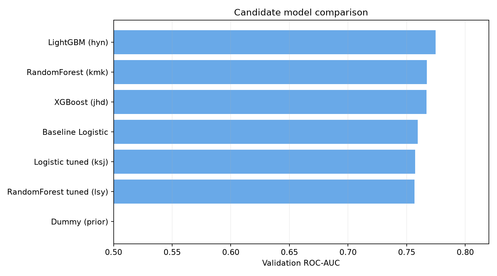
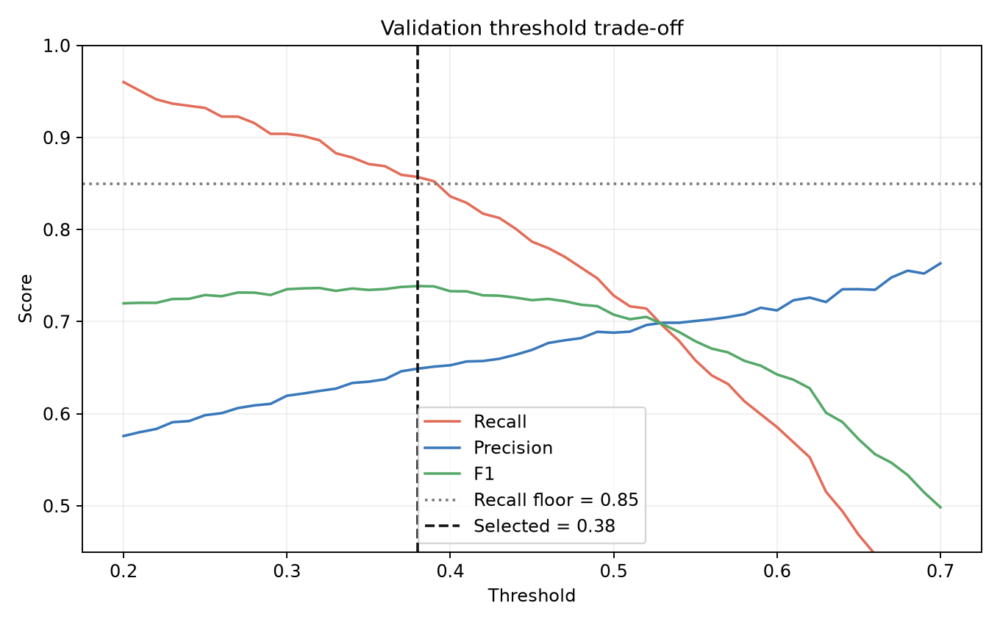
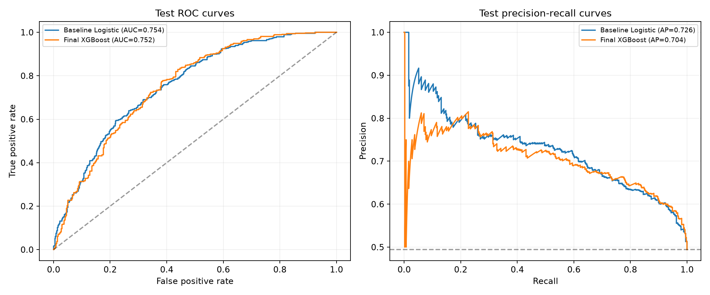
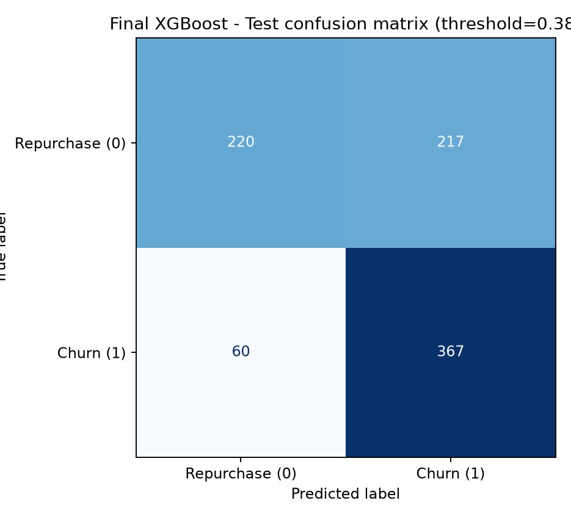
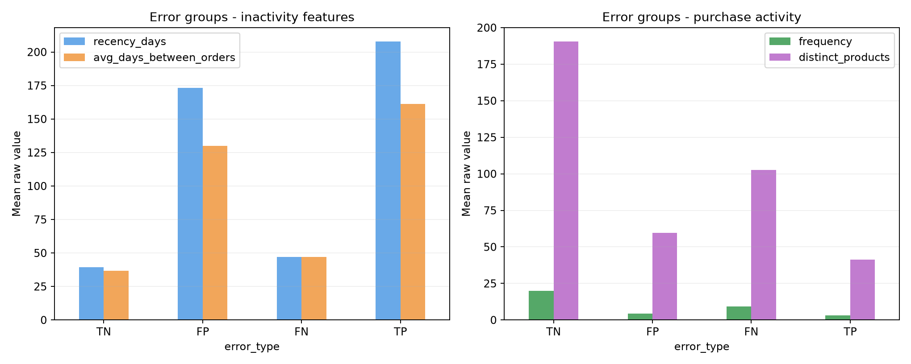
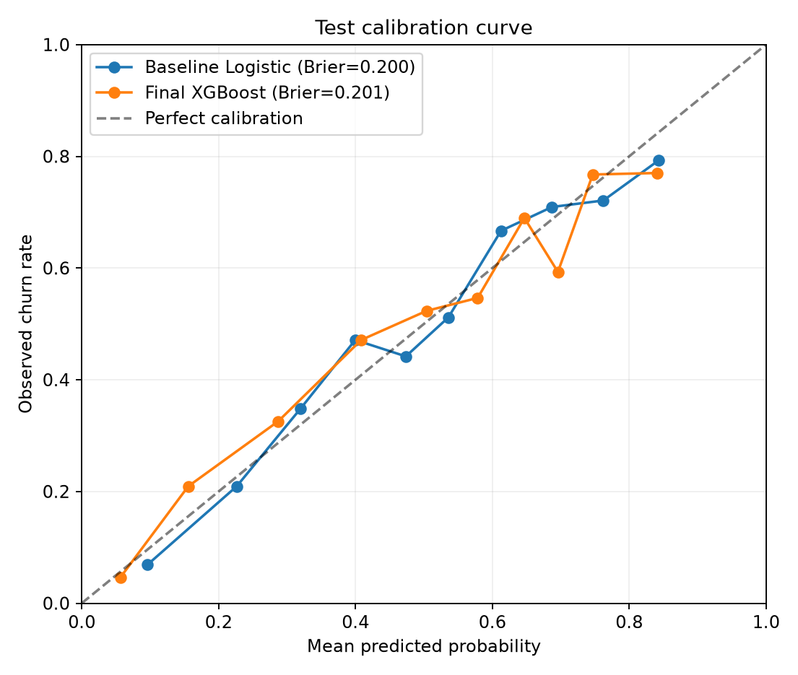
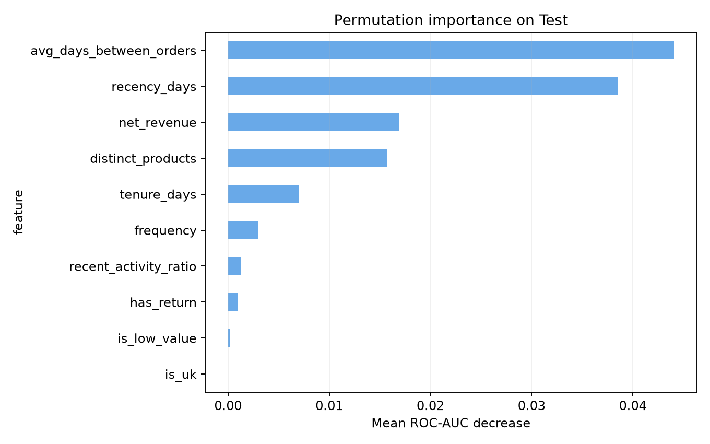

# 이커머스 구매 고객 재구매 이탈 예측 — 인공지능 모델 학습 결과서

이 문서는 여러 분류 모델을 어떤 조건으로 비교했는지, 운영 임계값 0.38을 어떻게 선택했는지, 그리고 왜 XGBoost를 최종 운영 모델로 채택했는지를 재현 가능한 형태로 기록한다. 모든 수치는 `notebooks/model_experiments.ipynb`를 실행해 저장 모델과 공용 데이터에서 다시 계산했다.

## 1. 문제 유형

본 과제는 고객별 재구매 이탈 여부를 예측하는 이진 분류 문제다.

| 구분 | 정의 |
|---|---|
| 분석 단위 | 기준일 이전 365일 안에 구매한 식별 가능 고객 1명 |
| 예측 시점 | 2011-09-10 |
| 입력 | 예측 시점 이전 거래로 생성한 고객 행동 Feature 10개 |
| `churn=1` | 기준일 다음 날부터 90일 동안 정상 재구매가 없음 |
| `churn=0` | 같은 기간에 정상 재구매가 있음 |
| 모델 출력 | 고객이 `churn=1`일 확률 |

실제 회원 탈퇴 기록이 존재하는 것은 아니므로, 여기서 이탈은 90일 미구매로 정의한 재구매 이탈 대리 Target이다.

## 2. 데이터 분할

전체 고객 스냅샷 4,320명을 Target 비율을 보존하는 층화 무작위 분할로 나눴다.

| 데이터 | 고객 수 | 비율 | 용도 |
|---|---:|---:|---|
| Train | 2,592 | 60% | 전처리기와 모델 학습 |
| Validation | 864 | 20% | 후보 비교, 하이퍼파라미터 및 Threshold 결정 |
| Test | 864 | 20% | 최종 모델과 Threshold 확정 후 1회 평가 |

- 공통 `random_state=42`
- `stratify=y`로 각 분할의 이탈 비율 유지
- 전처리기는 Train에만 `fit`
- Test는 모델 또는 Threshold 선택에 사용하지 않음

현재 분할은 무작위 층화 방식이다. Feature 생성 시 미래 거래 유입은 차단했지만, 실제 미래 일반화 성능을 더 엄격하게 보려면 여러 기준일을 이용한 시간 순서 검증이 필요하다.

## 3. 기준 모델

두 가지 기준을 두었다.

1. `DummyClassifier(strategy="prior")`: Feature를 사용하지 않는 무작위 수준의 기준이다.
2. `LogisticRegression(max_iter=1000, random_state=42)`: 복잡한 모델이 단순 선형 모델보다 실질적인 이점이 있는지 확인하는 학습 기준이다.

Validation에서 Dummy의 ROC-AUC는 0.500이었다. 기본 Logistic Regression의 ROC-AUC는 0.760, PR-AUC는 0.731로 나타나 고객 행동 Feature 자체에 유효한 예측 신호가 있음을 확인했다.

## 4. 비교 모델

팀원이 독립적으로 학습해 저장한 후보를 공용 Validation 데이터에서 다시 불러와 동일한 평가 함수로 비교했다.

| 모델군 | 선정 이유 | 저장 산출물 |
|---|---|---|
| Logistic Regression | 해석이 쉽고 강한 선형 기준 제공 | `models/ksj/model_final.joblib` |
| Random Forest | 비선형성과 변수 상호작용 학습 | `models/kmk/model_final.joblib`, `models/lsy/model_final.joblib` |
| XGBoost | 규제와 부스팅을 이용한 표형 데이터 분류 | `models/jhd/model_final.joblib` |
| LightGBM | 효율적인 부스팅과 XGBoost 대안 비교 | `models/hyn/model_final.joblib` |

최종 비교에서는 저장 모델을 하드코딩한 점수가 아니라 실제로 로드하고 `predict_proba()`를 다시 실행했다. 후보마다 확률 분포가 다르므로 0.5만 비교하지 않고, 공통 Threshold 선택 규칙도 함께 적용했다.

## 5. 학습 조건

### 5.1 공통 조건

- 입력 데이터: `data/preprocessed/X_train.csv`, `X_val.csv`, `X_test.csv`
- Target: 각 분할의 `y_*.csv`에 있는 `churn`
- 모델 입력 Feature: 10개
- 클래스 재표본화: 사용하지 않음
- 최종 XGBoost의 `class_weight`, `scale_pos_weight`: 사용하지 않음
- 후보 비교 데이터: 공용 Validation 864명
- 공통 운영점 탐색: 0.20~0.70을 0.01 간격으로 스캔
- 공통 후보 규칙: Recall 0.80 이상인 지점 중 F1 최대

### 5.2 최종 XGBoost 하이퍼파라미터

| 파라미터 | 값 |
|---|---:|
| `n_estimators` | 250 |
| `learning_rate` | 0.02 |
| `max_depth` | 4 |
| `min_child_weight` | 3 |
| `subsample` | 0.7 |
| `colsample_bytree` | 0.9 |
| `reg_alpha` | 0.1 |
| `reg_lambda` | 3 |
| `eval_metric` | logloss |
| `random_state` | 42 |

세부 후보 학습은 각 팀원 노트북에서 수행됐으며 LightGBM·XGBoost 후보는 Validation 및 5-fold `StratifiedKFold` 검증을, Random Forest와 Logistic Regression 후보는 파라미터 탐색과 Validation 평가를 사용했다. 최종 재현 스크립트는 저장 후보를 동일한 Validation 데이터와 동일한 지표 함수로 재평가한다.

후보별 탐색 방법과 탐색 예산이 완전히 같지는 않다. 따라서 이 비교는 엄밀한 알고리즘 벤치마크라기보다 팀이 만든 최종 후보 중 운영안을 선택하기 위한 비교다.

## 6. 평가 지표

| 지표 | 프로젝트에서의 의미 |
|---|---|
| Accuracy | 전체 고객 중 재구매·이탈을 맞춘 비율 |
| Precision | 이탈 예측 고객 중 실제 이탈 고객 비율 |
| Recall | 실제 이탈 고객 중 탐지한 비율 |
| F1 | Precision과 Recall의 조화평균 |
| ROC-AUC | Threshold와 무관한 전체 순위 판별력 |
| PR-AUC(AP) | 양성 클래스인 이탈 탐지의 Precision-Recall 품질 |

주요 비즈니스 지표는 Recall이다. 실제 이탈 고객을 놓치는 FN은 고객을 유지할 기회 자체를 잃지만, 정상 고객을 이탈로 판단하는 FP는 비교적 저비용의 이메일·문자·쿠폰 캠페인으로 관리할 수 있다고 가정했다. 다만 모든 고객을 이탈로 예측하는 퇴화를 막기 위해 F1과 Precision을 동시에 확인했다.

## 7. Validation 성능 비교

아래 표는 각 모델에서 `Recall ≥ 0.80`을 만족하는 Threshold 중 F1이 최대인 지점을 공통 규칙으로 계산한 결과다.

| 모델 | Threshold | Recall | Precision | F1 | ROC-AUC | PR-AUC |
|---|---:|---:|---:|---:|---:|---:|
| LightGBM | 0.45 | 0.860 | 0.644 | 0.736 | **0.775** | **0.747** |
| XGBoost | **0.38** | 0.857 | **0.649** | **0.739** | 0.767 | 0.735 |
| Random Forest (kmk) | 0.35 | **0.892** | 0.626 | 0.736 | 0.767 | 0.739 |
| Random Forest (lsy) | 0.33 | 0.890 | 0.627 | 0.736 | 0.757 | 0.727 |
| Logistic Regression (튜닝) | 0.37 | 0.850 | 0.629 | 0.723 | 0.757 | 0.730 |
| 기본 Logistic Regression | 0.35 | 0.871 | 0.618 | 0.723 | 0.760 | 0.731 |



LightGBM은 ROC-AUC와 PR-AUC가 가장 높았고 Random Forest는 Recall이 가장 높았다. XGBoost는 Recall 제약을 만족하면서 F1 0.739와 Precision 0.649로 공통 운영점에서 가장 균형이 좋았다. 모델 간 차이가 매우 작기 때문에 XGBoost가 모든 관점에서 압도적으로 우수하다고 해석하지 않는다.

## 8. 임계값 결정

최종 XGBoost의 운영 Threshold는 Validation에서만 다음 절차로 선택했다.

1. Threshold 0.20~0.70을 0.01 간격으로 스캔한다.
2. 프로젝트의 운영 목표에 맞춰 `Recall ≥ 0.85`인 후보만 남긴다.
3. 남은 후보 중 F1이 가장 높은 값을 선택한다.
4. 동률이면 더 높은 Threshold를 선택해 불필요한 FP를 줄인다.
5. 선택한 0.38을 고정하고 Test에서는 재조정하지 않는다.

| Validation 지표 | Threshold 0.38 결과 |
|---|---:|
| Accuracy | 0.700 |
| Precision | 0.649 |
| Recall | 0.857 |
| F1 | 0.739 |
| TN / FP / FN / TP | 239 / 198 / 61 / 366 |



0.38은 전체 고객의 38%를 선정한다는 뜻이 아니다. 모델이 출력한 이탈 확률이 0.38 이상인 고객을 캠페인 대상으로 분류한다는 뜻이며, 대상 고객 비율은 실제 입력 데이터의 확률 분포에 따라 달라진다.

## 9. 최종 Test 평가

모델과 Threshold를 모두 고정한 뒤 Test 864명에 한 번 적용했다.

| 모델/기준 | Accuracy | Precision | Recall | F1 | ROC-AUC | PR-AUC |
|---|---:|---:|---:|---:|---:|---:|
| Baseline Logistic, 0.50 | 0.683 | 0.675 | 0.691 | 0.683 | **0.754** | **0.726** |
| Final XGBoost, 0.38 | 0.679 | 0.628 | **0.860** | **0.726** | 0.753 | 0.704 |

최종 운영안은 기본 Logistic 대비 Recall이 16.86%p, F1이 4.31%p 증가했다. 대신 Precision은 4.67%p, Accuracy는 0.35%p 낮아졌다. ROC-AUC와 PR-AUC도 기본 Logistic이 근소하게 높으므로, XGBoost가 확률 순위 판별력 자체를 개선했다기보다 Threshold를 포함한 운영안에서 이탈 탐지를 강화한 것으로 해석해야 한다.



## 10. 오류 분석

최종 XGBoost, Threshold 0.38의 Test 혼동행렬은 다음과 같다.

| 실제 \ 예측 | 재구매 `0` | 이탈 `1` |
|---|---:|---:|
| 재구매 `0` | TN 220 | FP 217 |
| 이탈 `1` | FN 60 | TP 367 |



- FN 60명: 실제 이탈 고객이지만 캠페인 대상에서 제외된다. 잠재 고객가치와 향후 매출을 잃을 가능성이 있는 핵심 오류다.
- FP 217명: 실제로는 재구매하지만 캠페인 대상으로 분류된다. 캠페인 비용과 과도한 할인으로 인한 마진 손실이 발생할 수 있다.
- 기본 Logistic 0.5와 비교하면 TP가 72명 증가하고 FN이 132명에서 60명으로 감소하지만, FP는 142명에서 217명으로 75명 증가한다.

동일한 분할 규칙으로 전처리 이전 고객 Feature를 복원해 오류 고객군의 평균 행동을 비교했다.

| 오류 유형 | 고객 수 | 최근 구매 경과일 | 구매 횟수 | 상품 다양성 | 평균 구매 간격 | 최근 활동 비중 |
|---|---:|---:|---:|---:|---:|---:|
| FN | 60 | 47.2 | 9.27 | 102.68 | 46.98 | 0.327 |
| FP | 217 | 173.3 | 4.22 | 59.47 | 129.84 | 0.109 |
| TN | 220 | 39.3 | 19.85 | 190.53 | 36.78 | 0.220 |
| TP | 367 | 207.9 | 3.27 | 41.40 | 161.34 | 0.101 |



FN 고객은 최근 구매 후 평균 47일, 구매 9.3회로 비교적 활동적인 모습이라 모델이 재구매 고객으로 판단했지만 실제로는 이탈했다. 이는 과거 활동성이 높다가 갑자기 중단한 고객을 행동 집계 Feature만으로 포착하기 어렵다는 뜻이다. 반대로 FP 고객은 최근 구매 후 평균 173일, 평균 구매 간격 130일로 휴면 고객과 유사하지만 실제로 재구매했다. 장기 구매주기 고객이 FP에 포함될 가능성을 보여준다.

현재 전처리된 `X_test.csv`에는 익명 고객 ID가 없으므로 개별 오류 고객을 원거래까지 역추적하는 사례 분석은 할 수 없다. 향후에는 모델 입력에서 제외하되 별도 키 파일에 `CustomerID`를 보존해 FN·FP 고객의 구매 이력과 캠페인 비용을 분석해야 한다.

## 11. 확률 보정 점검

Test 데이터에서 예측 확률의 신뢰성을 Calibration Curve와 Brier Score로 점검했다. Brier Score는 낮을수록 확률 오차가 작다.

| 모델 | Brier Score | 평균 예측 확률 | 실제 이탈률 |
|---|---:|---:|---:|
| Baseline Logistic | 0.2003 | 0.4956 | 0.4942 |
| Final XGBoost | 0.2007 | 0.4919 | 0.4942 |



전체 평균 예측 확률은 실제 이탈률과 가깝지만, XGBoost의 Brier Score는 기본 Logistic보다 근소하게 높았다. 별도의 확률 보정 학습을 수행하지 않았으므로 `predict_proba`를 정확한 실제 이탈 발생률로 간주하면 안 된다. ROC-AUC는 위험 순위 성능으로 해석하고, ROI 결과는 캠페인 조건을 비교하기 위한 시나리오 추정치로 사용해야 한다.

## 12. 모델 해석

최종 모델은 비선형 XGBoost이므로 계수처럼 직접 해석할 수 없다. 보고서에서는 각 Feature를 섞었을 때 Test ROC-AUC가 얼마나 감소하는지 측정하는 Permutation Importance를 참고용으로 계산했다.



이 값은 Feature가 예측에 기여했음을 보여주지만 인과관계는 아니다. 상관된 Feature가 있으면 중요도가 서로 분산될 수 있으며, Test 데이터를 이용한 해석은 성능 선택이 아니라 최종 모델 행동을 설명하는 용도로만 사용했다. 개별 고객 설명이 필요하면 향후 SHAP을 Validation 또는 운영 표본에 추가할 수 있다.

## 13. 최종 모델 선정

최종 분류기는 `models/final/model_final.joblib`의 XGBoost이고 운영 Threshold는 0.38이다. 제출 및 신규 고객 예측용 단일 산출물은 전처리기와 분류기를 결합한 `models/churn_pipeline.joblib`이다.

선정 근거는 다음과 같다.

1. Validation에서 `Recall ≥ 0.80` 공통 조건을 만족하면서 후보 중 F1이 가장 높았다.
2. Precision 0.649로 높은 Recall만 추구해 모든 고객을 이탈로 분류하는 퇴화를 피했다.
3. Threshold 0.38의 Validation Recall 0.857이 Test에서 0.860으로 유사하게 재현됐다.
4. 저장 Pipeline을 새 Python 프로세스에서 다시 로드해 신규 고객 1행의 확률과 분류 결과가 출력되는 것을 검증했다.
5. 입력 Feature 순서와 Target 정의를 `artifacts/feature_schema.json`에 고정했다.

단, LightGBM의 Validation ROC-AUC·PR-AUC가 더 높고 기본 Logistic의 Test ROC-AUC·PR-AUC도 근소하게 높았다. 따라서 XGBoost 선정은 절대적인 알고리즘 우위가 아니라, 현재의 저비용 리텐션 캠페인 가정과 Recall 중심 운영 목적에 따른 선택이다.

## 14. 한계 및 개선 방향

- 실제 탈퇴가 아닌 90일 미구매 대리 Target이므로 비자발적 휴면과 장기 구매주기를 구분하지 못한다.
- 후보별 튜닝 방법과 탐색 예산이 동일하지 않아 완전히 통제된 알고리즘 비교가 아니다.
- 단일 Train/Validation/Test 분할 결과이므로 여러 기준일의 시간 교차검증이 필요하다.
- FP와 FN의 실제 비용 자료가 없어 `Recall ≥ 0.85`는 운영 가정에 기반한 기준이다.
- 확률 보정 상태를 점검했지만 별도의 보정 모델을 학습하지 않았으므로 0.38을 실제 이탈 가능성 38%로 해석하면 안 된다.
- 모델 해석은 전역 Permutation Importance 수준이며 개별 고객 사유 분석은 추가 구현이 필요하다.
- 운영 후 데이터 드리프트, 재학습 주기, 캠페인 성과 기반 Threshold 재조정 절차가 필요하다.

## 15. 재현 방법과 산출물

Jupyter에서 `notebooks/model_experiments.ipynb`를 열고 위에서부터 전체 셀을 실행한다.

```text
notebooks/
└── model_experiments.ipynb

reports/
├── training_report.md
└── figures/training/

artifacts/
├── calibration_metrics.csv
├── error_analysis.csv
├── feature_schema.json
├── model_metadata.json
├── metrics.csv
└── permutation_importance.csv

models/
├── churn_pipeline.joblib
└── final/model_final.joblib
```

`churn_pipeline.joblib`은 고객 집계 Feature 10개를 받아 내부 전처리 후 이탈 확률을 출력한다. `model_metadata.json`에는 모델과 Pipeline의 SHA-256 해시, 하이퍼파라미터, Threshold 선택 규칙이 기록된다.
